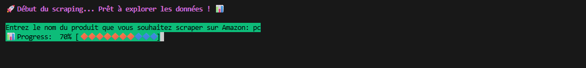
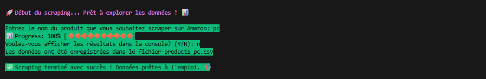
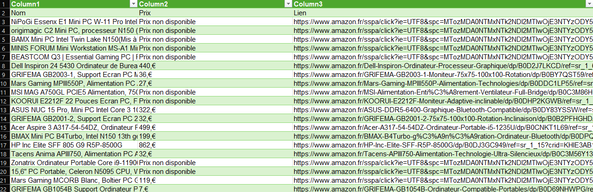

# Amazon Price Scraper


A sleek and efficient Python web scraper that extracts product information from Amazon.fr. This tool helps you quickly gather product names, prices, and links for market research and price comparison.


*Visual representation of the scraper interface*

## ✨ Features

- **Product Search**: Find any product on Amazon.fr
- **Price Extraction**: Get current pricing information in Euros
- **Direct Links**: Access product pages instantly
- **CSV Export**: Save results for further analysis
- **Console Preview**: Optional terminal display of results

## 🛠️ Tech Stack

- **Python 3** - Core programming language
- **BeautifulSoup4** - HTML parsing and data extraction
- **Requests** - HTTP requests handling
- **CSV Module** - Data export functionality

## 📦 Installation

1. Clone the repository:
```bash
git clone https://github.com/your-username/amazon-price-scraper.git
cd amazon-price-scraper
```
##🚀 Quick Start
Run the script with Python:

```bash
python amazon_scraper.py
```
### Follow the interactive prompts:

Enter the product name you want to search for
Choose whether to display results in the terminal (Y/N)
The script will:
Scrape product data from Amazon.fr
Save results to a CSV file named products_[search_query].csv

Optionally display formatted results in the terminal

## 📊 Output Format
The generated CSV file contains:

Nom: Product name

Prix: Price in Euros (€)

Lien: Direct URL to the product page

###  🎨 Terminal Preview
🚀 scarping : 
                        


✨ scarping successful :
       

 
🛍️ File output : 

The script displays a colorful progress bar during scraping

## 🎨 Design Features
Clean Interface: Simple command-line prompts

Efficient Code: Optimized scraping logic

Error Handling: Robust response checking

User-Friendly: Interactive options for display preferences

## ⚠️ Important Notes
This tool is for educational purposes only

Respect Amazon's Terms of Service and robots.txt

Consider adding delays between requests

Web scraping may be subject to legal restrictions

## 🔧 Customization
You can easily modify the script to:

Scrape additional product details

Change the target Amazon domain (.fr, .com, etc.)

Add price tracking over time

Implement email alerts for price drops

## 📄 License
This project is licensed under the MIT License - see the LICENSE file for details.

## 🌟 Related Projects
Check out our other web scraping tools:
Jumia Product Scraper : 


##⭐ If you find this project useful, please give it a star on GitHub!

### Powered by 🚀 ACHRAF EL BOUMASHOULI 🚀

Disclaimer: This project is not affiliated with or endorsed by Amazon.com, Inc. Amazon is a registered trademark of Amazon.com, Inc.
